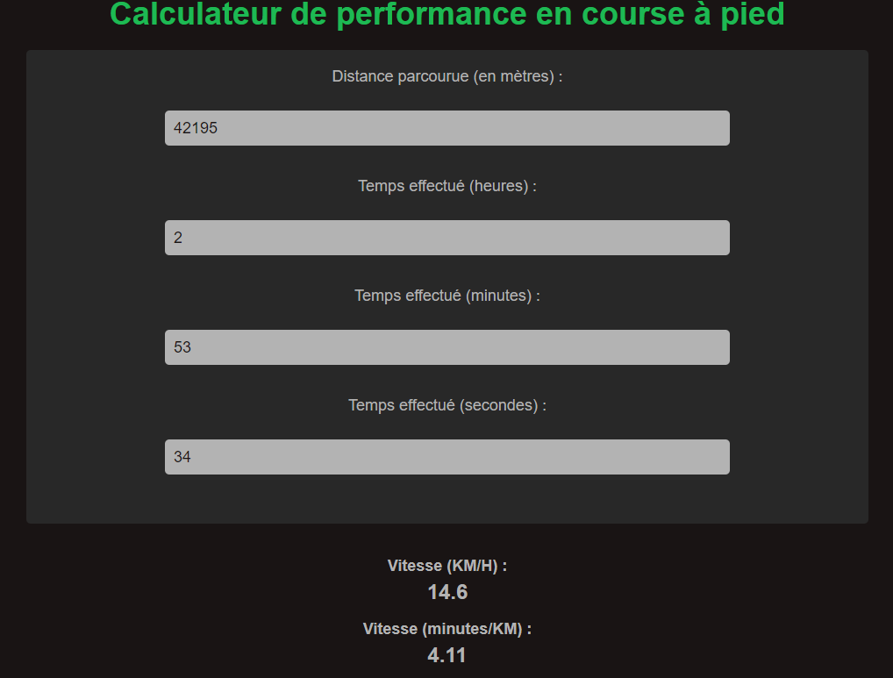

# Calculateur de performance en course à pied
Ce projet consiste en une application web qui permet de calculer les performances en course à pied d'un athlète en fonction de la distance parcourue et du temps effectué.

## Fonctionnalités
Demande à l'utilisateur de saisir la distance parcourue en mètres et le temps effectué en heures, minutes et secondes
Calcule et affiche la vitesse de l'athlète en KM/H et en minutes par KM
Arrondit les résultats de vitesse au dixième

## Demonstration
[DEMO](https://aguyonp.github.io/running-calculator/)

## Technologies utilisées
HTML pour structurer le contenu de la page web
CSS pour styliser la page web
JavaScript pour effectuer les calculs de performance en course à pied

## Comment utiliser l'application
Ouvrez l'application dans votre navigateur web préféré
Saisissez la distance parcourue en mètres et le temps effectué en heures, minutes et secondes dans les champs de formulaire
Les résultats de vitesse en KM/H et en minutes par KM sont automatiquement calculés et affichés sous les champs de formulaire

## Remarques
Si vous saisissez des valeurs négatives ou nulles pour la distance parcourue ou le temps effectué, les résultats de vitesse seront incorrects
Assurez-vous de saisir les valeurs de distance et de temps en unités appropriées (mètres et heures, minutes, secondes respectivement)
